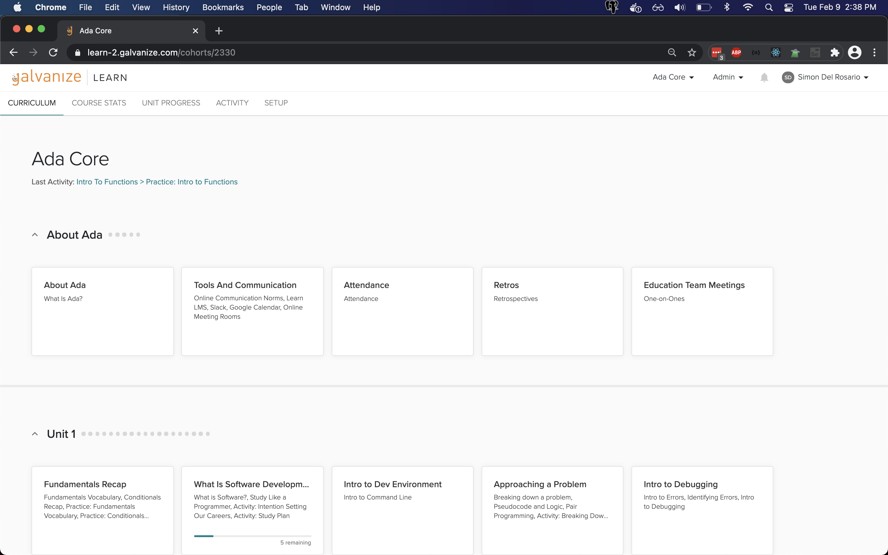
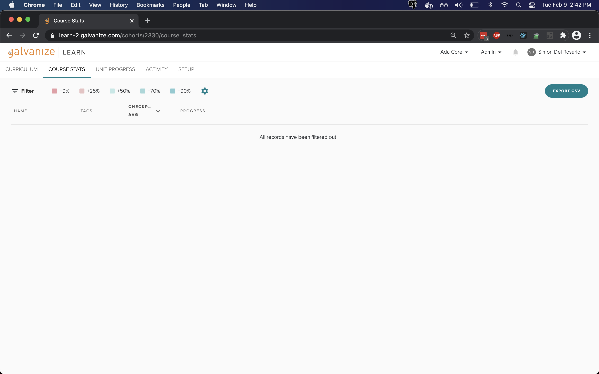
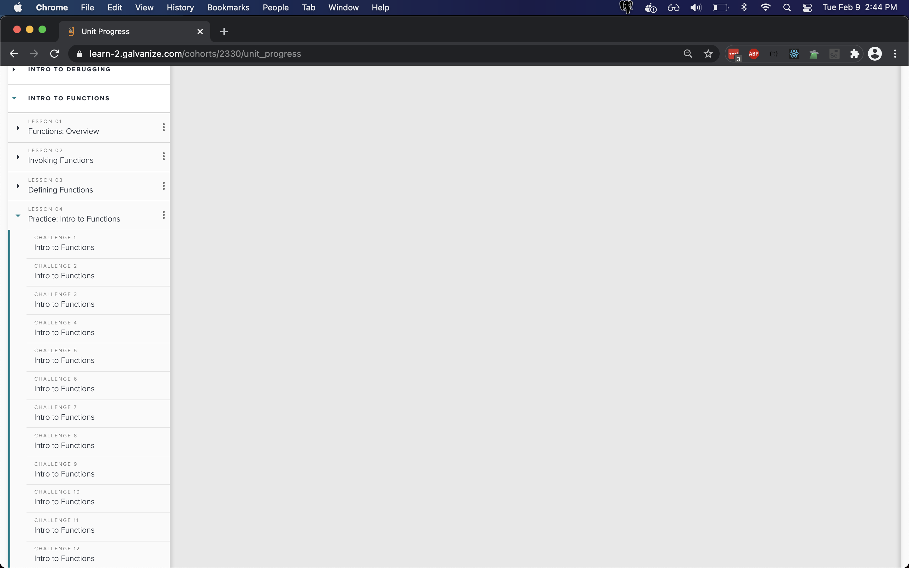

# Preview of the LMS

## The Learn Platform

- Learn is an learning management system (LMS). It specializes in supporting programming curriculum.

  - Has a lot of autograding capabilities
  - Tracks student progress well
  - Pushes Ada to form curriculum towards "visible forward progress" with clear feedback about what work has been done and what work remains

- Students will approach a **topic** which contains many **lessons**
  - For example, there is a **topic** "Intro to Tests"
  - This topic contains the following **lessons**:
    - Packages and Managing Packages
    - Automated Tests
    - Intro to pytest
    - Practice: Intro to pytest

- Learn supports a bunch of different autograded questions, such as:
  - Multiple choice
  - Reordering
  - Code challenges

- Code challenges will pass or fail based on provided tests
- The tests are technically written in unittest, not pytest. In my opinion, they're comparable/both readable
- Students can submit an infinite number of times
- Most/all code challenges will provide an example solution

- For the curious about the backend, Learn lets us look at student stats (how many challenges they get correct), and their progress (how many topics and lessons have they read and completed?)
- We get a lot of detail! We can see their submissions per question

## Projects

- Students will be assigned projects through Learn
- Each project will have a project overview with due dates, submission details, etc.

- Students will submit their project in two ways:
  1. Utilizing the autograding feature by submitting their project repo
  1. Giving us the ability to do code review by submitting a PR

- Project details will still live in project repos on GitHub

